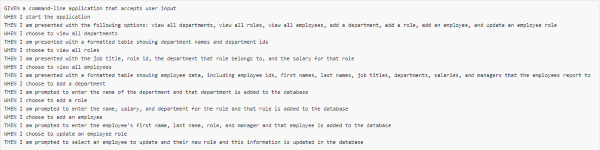
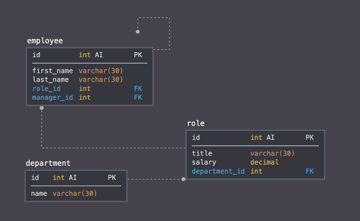
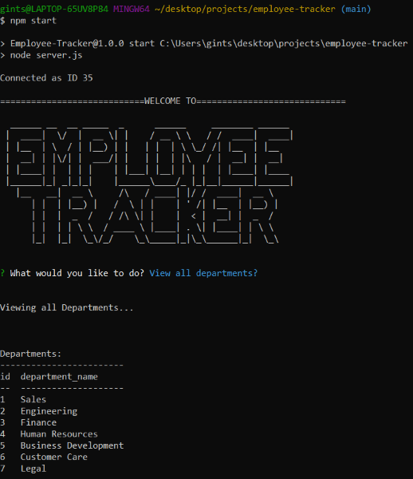
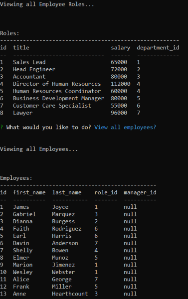
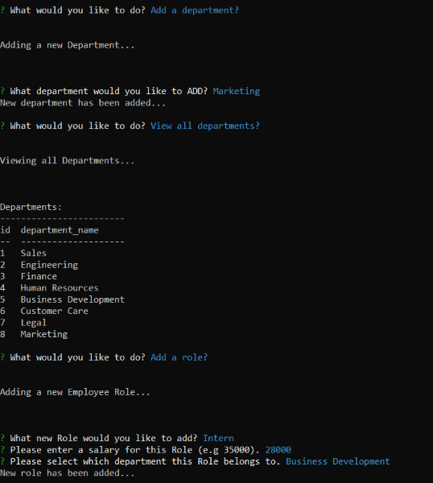

# Employee-Tracker       

## **Description**
Employee-Tracker is a command line application used to create, view, update and delete employee in a company database.  This application is the challenge for week #12 of the Upenn LPS coding bootcamp.  The following user story was provided to guide us in the development of Employee-Tracker: 

  

The following is the suggested schema that the tables in our database should follow:

  

## **Table of Contents**

* *[Installation](#installation)*
* *[Usage](#usage)*
* *[Contributing](#contributing)*
* *[Tests](#tests)*
* *[Questions](#questions)*
* *[License](#license)*

## **Installation**
Once the repistory has been cloned, use the command `npm install` or `npm i` to install the necessary dependencies: **[mySQL](https://www.npmjs.com/package/mysql2)**, **[console.table](https://www.npmjs.com/package/console.table)**, **[dotenv](https://www.npmjs.com/package/dotenv)**, **[figlet](https://www.npmjs.com/package/figlet)**, and **[Inquirer](https://www.npmjs.com/package/inquirer)**.  

## **Usage**

The app comes preloaded with tables in the schema.sql file and entries in the seeds.sql file. Feel free to edit this data to suit your needs.  When the the required data has been added, activate mySQL using the command `mysql -u root -p` in the terminal.  You will be prompted to enter you mySQL password.  To popute the table use the commands `source schema.sql` and `source seeds.sql`.  The app is now ready to be used. In a seperate terminal, not the mySQL CLI open the app using `npm start` or `Node server.js`.  You can now use Employee-Tracker!

### *Screenshots*

      

## **Contributing**

Please refer to the **[Contributor Covenant](https://www.contributor-covenant.org/)** for contribution guidelines.

## **Tests**  

No test need to be run at this time. 

## **Questions**

For any questions, comments, or feedback please feel free to reach out:  
- **[Github](https://github.com/gintstir)**
- **<gint.stirbys@gmail.com>**

## **License** 

Copyright © **Gintautas Stirbys**, 2021.  All Rights Reserved.

This Project is licensed under the **[Apache~2.0](https://www.apache.org/licenses/LICENSE-2.0)** license.

        
